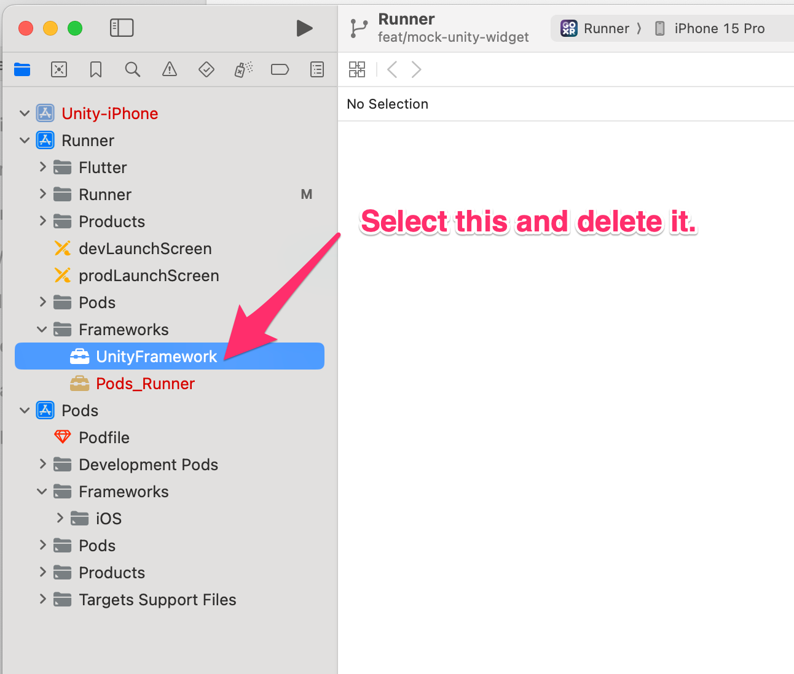

# TPFive Mobile

## Getting started

### IDE

1. Android Studio Flamingo | 2022.2.1
2. Unity Editor 2022.3.5f1
3. Flutter 3.10.6 LTS | Dart version: 3.0.6

* flutter sdk install(official): <https://docs.flutter.dev/get-started/install/macos>
* setup editor(official): <https://docs.flutter.dev/get-started/editor?tab=androidstudio>

After setup, please type

```bash
flutter doctor -v
```

to check if missing any dependencies.

### Debug with emulator and Android device

1. Get the .env file by excuting decrypt_env.sh local.
2. Use [ADB reverse](https://linuxcommandlibrary.com/man/adb-reverse) command. adb reverse tcp:[remote_port] tcp:[local_port].
3. Replace remote_port and local_port to AUTHING_DOMAIN port and SERVER_DOMAIN. For example: adb reverse tcp:9453 tcp:9453.
4. Run start debugging.

### Build iOS

0. run the pre-run script to modify the source code.
1. open the Unity project in Unity Editor.
2. export the Unity project to Xcode project via flutter-unity-widget on `Nav -> Flutter -> Export IOS (release)`.
3. the Xcode project will generated `exposed_flutter_unity_widget` in `one-unity/unity-project/development/complete-unity/`.
4. [OPTIONAL] change to the `exposed_flutter_unity_widget/ios/UnityLibrary` directory and run `pod install`.
5. execute `one-utility/link-unity-frameworks.py` to add related framework.
6. build the iOS project by `flutter build ios`, or `flutter run` to launch app on your device.

#### Pre-run script

Now build the iOS has some problem since the packages does not well support. In this case we need to
modify the source code before build the iOS project:

* `one-utility/patch-build-ios-app.sh` to remove unsupported packages.

, and you HAVE TO change the TEAM and BUNDLE ID in the Runner project.

* open by `open Runner.xcodeproj/project.pbxproj`.
* choose the Runner project in the left panel and choose the Runner target.
* change the Team and Bundle Identifier in the Signing & Capabilities tab.

In this case you need to have a valid Apple Developer account and a valid certificate.

## Using Mock Unity Widget

Mock Unity Widget provides a mock implementation of unity widget. Enabling rapid UI development in your local machine.
You can run the `one-utility/mock_unity.sh` script to enable mock unity widget.

### TL;DR

1. Remove flutter unity widget from pubspec.yaml file.

```diff
diff --git a/one-mobile/flutter_project/pubspec.yaml b/one-mobile/flutter_project/pubspec.yaml
index 137be5694..97e7ab477 100644
--- a/one-mobile/flutter_project/pubspec.yaml
+++ b/one-mobile/flutter_project/pubspec.yaml
@@ -50,11 +50,6 @@ dependencies:
   pull_to_refresh: ^2.0.0
   shared_preferences: ^2.2.1
   url_launcher: ^6.1.11
-  flutter_unity_widget:
-    git:
-      url: https://github.com/XRSPACE-Inc/flutter-unity-view-widget.git
-      # Temporary solution. We should revert this once this issue is fixed.
-      ref: fix-input-and-java-proxy
   flutter_dotenv: ^5.1.0
   freezed_annotation: ^2.4.1
   json_annotation: ^4.8.1
```

2. Replace the native Flutter Unity widget with a mock Unity widget by updating the import paths in `unity_message_widget.dart`
and `unity_message_service.dart`.

```diff
diff --git a/one-mobile/flutter_project/lib/feature/unity_holder/unity_message_widget.dart b/one-mobile/flutter_project/lib/feature/unity_holder/unity_message_widget.dart
index bbb538851..b0a033a1a 100644
--- a/one-mobile/flutter_project/lib/feature/unity_holder/unity_message_widget.dart
+++ b/one-mobile/flutter_project/lib/feature/unity_holder/unity_message_widget.dart
@@ -2,7 +2,7 @@ import 'dart:convert';

 import 'package:flutter/material.dart';
 import 'package:flutter_riverpod/flutter_riverpod.dart';
-import 'package:flutter_unity_widget/flutter_unity_widget.dart';
+import 'package:tpfive/feature/mock_unity_widget/unity_widget.dart';
 import 'package:freezed_annotation/freezed_annotation.dart';
 import 'package:get_it/get_it.dart';
 import 'package:tpfive/app.dart';
diff --git a/one-mobile/flutter_project/lib/services/unity_message_service.dart b/one-mobile/flutter_project/lib/services/unity_message_service.dart
index 42042a84f..a68f55b95 100644
--- a/one-mobile/flutter_project/lib/services/unity_message_service.dart
+++ b/one-mobile/flutter_project/lib/services/unity_message_service.dart
@@ -1,7 +1,7 @@
 import 'dart:async';

 import 'package:flutter_riverpod/flutter_riverpod.dart';
-import 'package:flutter_unity_widget/flutter_unity_widget.dart';
+import 'package:tpfive/feature/mock_unity_widget/unity_widget.dart';
 import 'package:tpfive/generated/freezed/generate_model.dart';
 import 'package:tpfive/utils/logger.dart';
 import 'package:uuid/uuid.dart';
```

3. For iOS, Remove flutter unity widget dependency in AppDelegate.swift and delete UnityFramework in xcode workspace.

```diff
diff --git a/one-mobile/flutter_project/ios/Runner/AppDelegate.swift b/one-mobile/flutter_project/ios/Runner/AppDelegate.swift
index c47e7292c..d6c720c2e 100644
--- a/one-mobile/flutter_project/ios/Runner/AppDelegate.swift
+++ b/one-mobile/flutter_project/ios/Runner/AppDelegate.swift
@@ -1,6 +1,5 @@
 import Flutter
 import UIKit
-import flutter_unity_widget

 @UIApplicationMain
 @objc class AppDelegate: FlutterAppDelegate {
@@ -8,7 +7,6 @@ import flutter_unity_widget
         _ application: UIApplication,
         didFinishLaunchingWithOptions launchOptions: [UIApplication.LaunchOptionsKey: Any]?
     ) -> Bool {
-        InitUnityIntegrationWithOptions(argc: CommandLine.argc, argv: CommandLine.unsafeArgv, launchOptions)
         handleAuthMethodCall()
         GeneratedPluginRegistrant.register(with: self)
         return super.application(application, didFinishLaunchingWithOptions: launchOptions)
```

Open ios/Runner.xcworkspace in xcode and delete UnityFramework


For Android Platform, modify `android/app/build.gradle` and `android/app/src/main/kotlin/com/xrspace/tpfive/MainActivity.kt`
to get rid of flutter_unity_widget dependency

```diff
diff --git a/one-mobile/flutter_project/android/app/build.gradle b/one-mobile/flutter_project/android/app/build.gradle
index 749665c00..f08d42828 100644
--- a/one-mobile/flutter_project/android/app/build.gradle
+++ b/one-mobile/flutter_project/android/app/build.gradle
@@ -88,6 +88,5 @@ flutter {

 dependencies {
     implementation "org.jetbrains.kotlin:kotlin-stdlib-jdk7:$kotlin_version"
-    implementation project(':unityLibrary')
     implementation 'com.xrspace.xrauth:porting:0.1.2'
 }
diff --git a/one-mobile/flutter_project/android/app/src/main/kotlin/com/xrspace/tpfive/MainActivity.kt b/one-mobile/flutter_project/android/app/src/main/kotlin/com/xrspace/tpfive/MainActivity.kt
index 5436b55e3..a414433af 100644
--- a/one-mobile/flutter_project/android/app/src/main/kotlin/com/xrspace/tpfive/MainActivity.kt
+++ b/one-mobile/flutter_project/android/app/src/main/kotlin/com/xrspace/tpfive/MainActivity.kt
@@ -6,10 +6,10 @@ import io.flutter.embedding.engine.FlutterEngine
 import io.flutter.plugins.GeneratedPluginRegistrant
 import android.os.Bundle
 import android.os.PersistableBundle
-import com.xraph.plugin.flutter_unity_widget.FlutterUnityActivity;
+import io.flutter.embedding.android.FlutterActivity
 import com.xrspace.xrauth.XrAuthPlugin

-class MainActivity: FlutterUnityActivity() {
+class MainActivity: FlutterActivity() {
     override fun configureFlutterEngine(flutterEngine: FlutterEngine) {
         GeneratedPluginRegistrant.registerWith(flutterEngine)

```

4. All set! you can run app with following command

```bash
flutter run --flavor dev --target lib/main_dev.dart
```

## Permission setting

We use flutter permission_handler package to manage permission.
While the permissions are being requested during runtime,
you'll still need to tell the OS which permissions your app might potentially use.
This requires adding permission configuration to Android* and iOS-specific files.

Please remember to add corresponding permission config to the files. ref: <https://pub.dev/packages/permission_handler>
