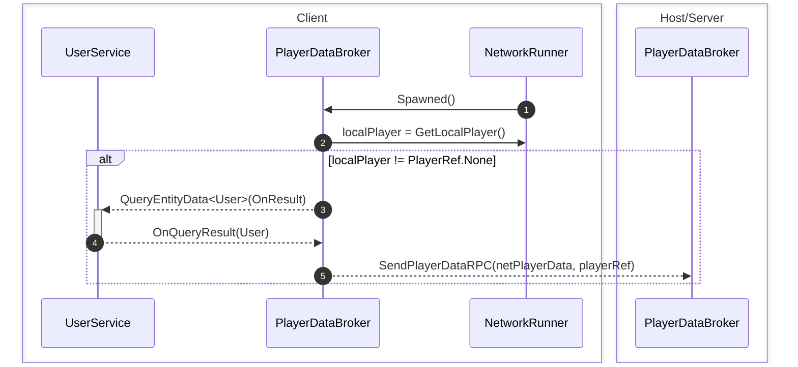
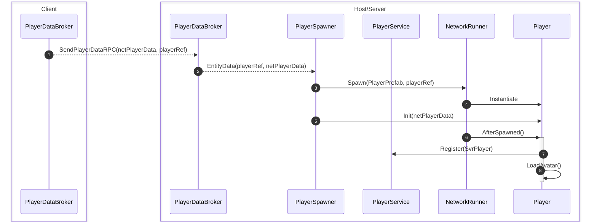
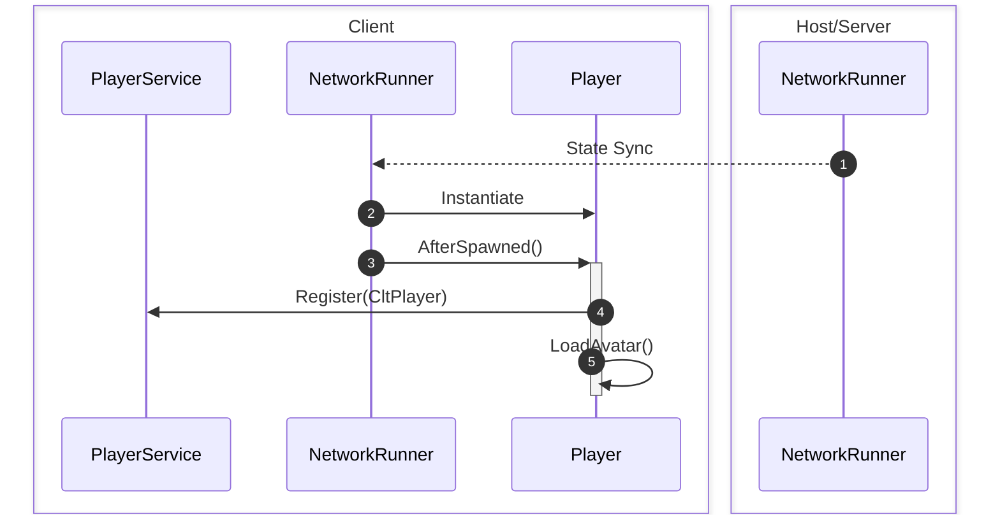

# In-room player-spawning Peocedure

## Introduce

### 1. Client queries and uploads player data to Host/Server

### 2. Server/Host receives player data from client and spawns player in room

### 3. The newly-created player is synchronized with and spawned on clients

